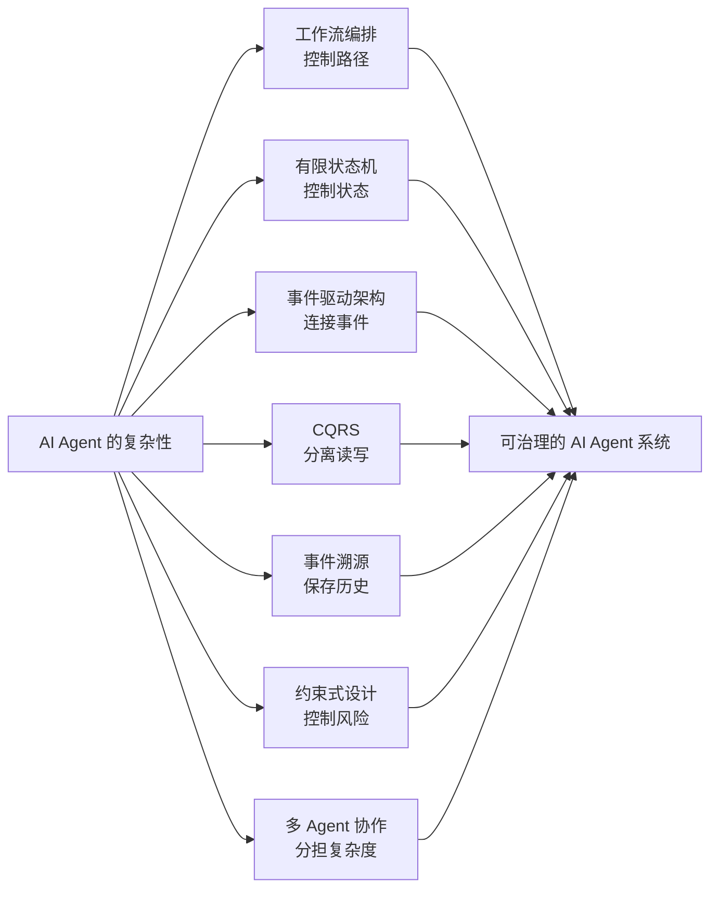

# DDD 之外，AI Agent 系统治理复杂性的 7 种架构范式

AI Agent 系统之所以难，不只是因为“有 LLM”，而是因为它把不确定性、长流程、外部工具、状态记忆和人类反馈揉在了一起。  
在这种系统里，DDD 仍然有价值，但它只是治理复杂性的一种方法；真正落地时，往往需要工作流、状态机、事件驱动、CQRS、事件溯源、约束式设计和多 Agent 协作一起上场。 [aipmguru.substack](https://aipmguru.substack.com/p/ai-architecture-patterns-101-workflows)

## 先说结论

如果你的目标是“把 Agent 做稳定”，那最有效的办法通常不是让模型更自由，而是**把自由度拆开、限制住、记录下来、再逐步放开**。  
从工程角度看，AI Agent 系统更像一组需要编排、隔离、观测和反馈的动态过程，而不是单一的智能模块。 [orkes](https://orkes.io/blog/agentic-ai-explained-agents-vs-workflows/)

下面这 7 种范式，基本覆盖了现在最实用的治理思路。

## 1. 工作流编排

工作流编排适合把任务拆成明确步骤：先做什么、后做什么、在哪一步检查、失败怎么回退，都写清楚。 [aipmguru.substack](https://aipmguru.substack.com/p/ai-architecture-patterns-101-workflows)
它的核心价值是把“Agent 自由发挥”收紧成“可控流程”，特别适合高风险、强约束、步骤明确的任务，比如文档生成、审批流、代码修复流水线。  
和纯 Agent 相比，工作流的优势不是更聪明，而是更可预期。

一个很实用的判断是：  
如果任务可以被稳定拆成 5 到 10 个步骤，而且每一步都有明确输入输出，那就优先用工作流，而不是让模型临场发挥。

## 2. 有限状态机

有限状态机特别适合管理 Agent 的生命周期和动作许可。  
比如一个 Agent 可以处于 `idle → thinking → acting → waiting → failed → recovered` 这样的状态链中，每个状态只允许一部分动作发生。  
这样做的好处是，你不是在“相信模型不会乱来”，而是在“系统层面禁止它乱来”。

状态机尤其适合处理那些状态变化清晰、动作边界明确的场景，比如任务调度、审批、重试、人工接管。  
它和工作流很像，但更强调“当前状态决定下一步能做什么”。

## 3. 事件驱动架构

事件驱动架构是 AI Agent 系统里非常重要的一层，因为 Agent 天生就是事件响应型系统。 [axoniq](https://www.axoniq.io/blog/agentic-ai-architecture-event-store-databases-for-glass-box-ai-systems)
用户输入、工具返回、环境变化、失败信号、人工反馈，这些都可以成为事件，然后触发下一步行为。  
这种方式的最大价值是让系统天然具备解耦、异步、可追踪的特性。

对 Agent 来说，事件驱动不是“锦上添花”，而是一个现实需求：  
你不一定能预测 Agent 会走哪条路，但你至少要知道它走过哪条路。  
这对调试、审计、告警和运行时治理都非常关键。 [axoniq](https://www.axoniq.io/blog/agentic-ai-architecture-event-store-databases-for-glass-box-ai-systems)

## 4. CQRS

CQRS 的核心是把读和写分开。  
在 Agent 系统里，这个模式特别有用，因为“读上下文”和“做决策”本来就是两类完全不同的工作。 [xebia](https://xebia.com/blog/event-sourcing-and-cqrs-in-action/)
读路径负责聚合信息、检索知识、构建上下文；写路径负责决策、执行和状态变更。

这么做的好处很直接：

- 读可以更灵活、更快。
- 写可以更严格、更安全。
- 两边可以独立演进。

很多 Agent 系统的问题，其实不是模型不够强，而是读写混在一起：既要拼上下文，又要做动作，还要控制状态，最后系统就很难治理。  
CQRS 能把这三件事拆开。

## 5. 事件溯源

如果你想把 Agent 的行为“看得见、回得去、分析得出”，事件溯源几乎是必选项。 [xebia](https://xebia.com/blog/event-sourcing-and-cqrs-in-action/)
它的思路不是直接保存最终状态，而是保存状态变化的全过程。  
之后你可以通过重放事件重建当前状态，也可以回看历史状态，分析 Agent 为什么做出某个决定。

这对 AI Agent 特别重要，因为 Agent 的不确定性不是 bug，而是特性。  
你无法要求它每次都完全一致，但你必须要求它每次都能留下痕迹。  
在复杂系统里，**可追溯**往往比“完全可预测”更现实。

## 6. 约束式设计

约束式设计不一定是一个单独的“教科书式架构名词”，但它是 Agent 系统里最实用的治理思路之一。  
核心原则很简单：先定义边界，再让模型活动。  
这些边界包括权限边界、资源边界、动作边界、输出边界和风险边界。

举个例子：  
你可以允许模型生成代码，但不允许它直接提交到生产；  
你可以允许模型提出执行建议，但不允许它绕过审核；  
你可以允许模型调用工具，但必须限制其参数范围和频率。

这类设计的重点不是“限制智能”，而是**防止不确定性变成系统事故**。  
在生产环境里，安全边界比模型创意更重要。

## 7. 多 Agent 协作

当问题复杂度继续上升，一个 Agent 往往不够用。  
这时更合理的方式是把系统拆成多个角色：规划 Agent、执行 Agent、审查 Agent、监控 Agent，甚至再加一个负责仲裁的中心控制层。 [techcommunity.microsoft](https://techcommunity.microsoft.com/blog/educatordeveloperblog/ai-agents-the-multi-agent-design-pattern---part-8/4402246)

多 Agent 协作的优点在于：

- 不同角色关注点不同。
- 一个 Agent 出错，不至于全局失控。
- 角色之间可以互相制衡。

这和现实组织很像：复杂任务往往不是靠一个“全能员工”完成的，而是靠分工和协作。  
对于 AI 系统来说，多 Agent 也是一种治理复杂性的方法，而不只是“堆更多模型”。

## 怎么选

下面这张表可以直接当作选型参考：

| 场景特征 | 更适合的范式 |
|---|---|
| 流程固定、步骤明确 | 工作流编排 |
| 状态变化清晰、动作受限 | 有限状态机 |
| 任务长、需要审计和回放 | 事件驱动 / 事件溯源 |
| 读写模式差异大 | CQRS |
| 高风险、高合规要求 | 约束式设计 |
| 任务复杂、角色分工明显 | 多 Agent 协作 |

## 一个更现实的组合方式

真正能治理复杂 AI Agent 系统的，通常不是单一范式，而是组合拳：

- 用**工作流**控制大任务路径。
- 用**状态机**限制当前可行动作。
- 用**事件驱动**连接各个阶段。
- 用**事件溯源**保存全过程。
- 用**CQRS**分离读写职责。
- 用**约束式设计**兜住安全边界。
- 用**多 Agent**分担复杂职责。

换句话说，DDD 更像是“边界设计”，这些范式更像是“运行时治理”。  
前者告诉你系统该怎么分区，后者告诉你系统该怎么跑。

## 最后的判断

如果把 AI Agent 系统比作一台不断学习和调整的机器，那么不确定性不是异常，而是常态。  
治理这种系统，不能只靠“让模型更聪明”，而要靠一整套架构手段，把自由、约束、历史和反馈组织起来。 [aws.amazon](https://aws.amazon.com/cn/blogs/china/application-agent-development/)

所以，DDD 之外当然还有很多办法，而且在很多场景里，它们比 DDD 更直接、更好用。  
但最关键的不是“选哪一个”，而是知道什么时候用流程，什么时候用状态，什么时候记录历史，什么时候分工协作。

如果你接下来要做的不是概念讨论，而是上生产，那么优先级通常是：

1. 先用工作流和状态机把系统收紧。  
2. 再用事件驱动和事件溯源把过程记下来。  
3. 再用 CQRS 和约束层把读写与风险隔开。  
4. 最后再考虑多 Agent 协作去扩展复杂度。

这会比一开始就追求“全自主智能”靠谱得多。

如果你愿意，我可以下一步把这篇文章再加工成更适合发布的版本，加上：
- 更像公众号的开头和结尾，
- 适合社群转发的小标题，
- 以及一张“7 种范式对比图”的文字草图。