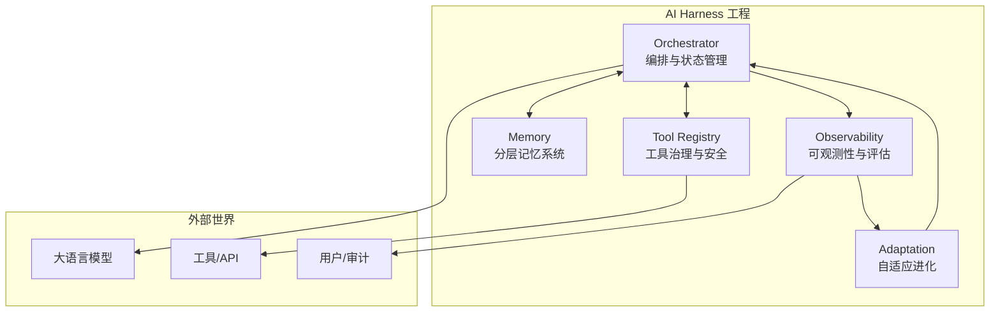

基于学术论文和工程实践的综合分析，一个完整的 AI Harness 工程通常由 **5 个核心部分组成**。学术论文《AI Harness Engineering》将其形式化为 11 项组件责任，而在工程落地中，这些责任聚合为以下五大模块：

---

## 一、核心编排与状态管理

这是 Harness 的“大脑”，负责控制 Agent 的执行流程和状态转换。

**关键组件：**
- **Orchestrator（编排器）**：管理任务从创建到完成的全生命周期，独占决策权（何时执行、何时停止、何时重试）
- **状态机**：维护 Agent 的显式状态（idle/working/waiting/failed），确保状态转换的确定性
- **执行计划裁决**：Planner Agent 输出声明式计划，由 Harness 接管执行（而非让 Agent 自己决定调用顺序）

**核心原则：** Agent 负责局部智能，Harness 负责全局控制。

---

## 二、工具治理与安全边界

工具是 Agent 能力的来源，也是风险的入口。Harness 必须将工具从“普通函数调用”提升为“受治理的生产资源”。

**关键组件：**
- **Tool Registry（工具注册表）**：每个工具登记九项元信息（名称、描述、JSON Schema、允许调用的 Agent 列表、超时、速率限制、风险等级、是否需要人工确认、审计策略）
- **Tool Executor**：统一执行入口，支持参数校验、超时控制、结果截断（如 `read` 工具按 offset/limit 分页读取大文件）
- **权限与沙箱**：路径保护、SSH 执行隔离、敏感操作需人工确认

**设计要点：** 工具设计要守住几条线——输入有 schema、输出适合模型消费、大输出要截断、有副作用的工具返回 diff。

---

## 三、分层记忆与上下文管理

“记忆”在 AI Agent 中不是浪漫概念，而是工程问题。Harness 必须区分状态与记忆，并分层管理。

**分层架构：**

| 层级 | 生命周期 | 存储方式 | 用途 |
|------|----------|----------|------|
| Working State | 当前步骤 | 内存 | 临时上下文，任务结束即丢 |
| Session State | 单次会话 | Redis + TTL | 多 Agent 共享信息 |
| Execution Log | 永久 | JSONL / 事件流 | 审计、回放、评估 |
| Episodic Memory | 跨会话 | 向量数据库 | 踩过的坑、用户偏好 |
| Semantic Memory | 持久 | 知识库 | 领域概念、业务规则 |

**上下文压缩（Compaction）**：当上下文过长时，将早期内容交给模型总结为摘要，保留近期消息。完整历史仍保存在 JSONL 中，模型看到的是压缩视图。

---

## 四、可观测性与评估体系

Harness 必须让 Agent 的执行过程可审计、可调试、可优化，而非黑盒。

**关键组件：**
- **事件溯源**：每次用户输入、模型输出、工具调用、文件修改都记录为不可变事件。`pi` 项目使用 JSONL 格式的 session 文件
- **执行轨迹捕获**：timestamps、I/O snapshots、failures、LLM调用次数与成本
- **评估框架**：学术论文《AI Harness Engineering》提出 H0-H3 四级评估阶梯，从“仅输出 patch”到“输出可复现的验证报告”
- **失败归因**：将失败分类（auth_expired、tool_missing、retry_exhausted、verification_failed），并触发对应的 Harness Mutation

---

## 五、自适应与进化机制

这是 Harness 区别于传统工作流引擎的核心特征——能够根据执行反馈自我修正。

**关键组件：**
- **Harness Evolution Loop**：Worker Agent 执行任务 → Evaluator Agent 诊断失败 → Evolution Agent 修改 Harness 配置（如换更便宜的模型、增加重试策略、添加验证钩子）
- **Harness Mutation**：结构化的规格修改类型，包括 add-node、replace-node（换模型）、add-verification、tighten-guardrail（收紧预算限制）
- **Guardrails（硬闸）**：max_steps、cost_limit_usd、timeout 三道硬限制，超限时抛出 GuardrailExceededError

**设计示例（Lasso 项目）：**
```
执行 trace → deriveMutationsFromTrace() → mutateHarness(spec, mutations)
→ 自动替换昂贵模型为更便宜的版本 → 新版本继续执行
```


## 总结：Harness 的完整视图



这五个部分共同构成了 Agent 的“操作系统”——它不是简单的 Prompt 模板拼盘，而是让 Agent 从“即兴表演”变成“稳定每晚演两场，连演一年”的工程底座。

> **延伸阅读**：本文的五模块架构在“认知与决策驱动设计”范式中对应**决策层 + 治理层**。
> 编排/状态管理 → Adjudicator + AgentHarnessPhase
> 工具治理 → SemanticFirewall + ToolRegistry
> 分层记忆 → EpisodeMemory + WorkingMemory
> 可观测性 → AgentEvent + SessionStore
> 自适应进化 → （当前空缺）
> 完整范式定义见 `docs/ai-agent-archi/cognition-decision-driven-design.md`，uncode 实现见 `docs/uncode-technologies/`。