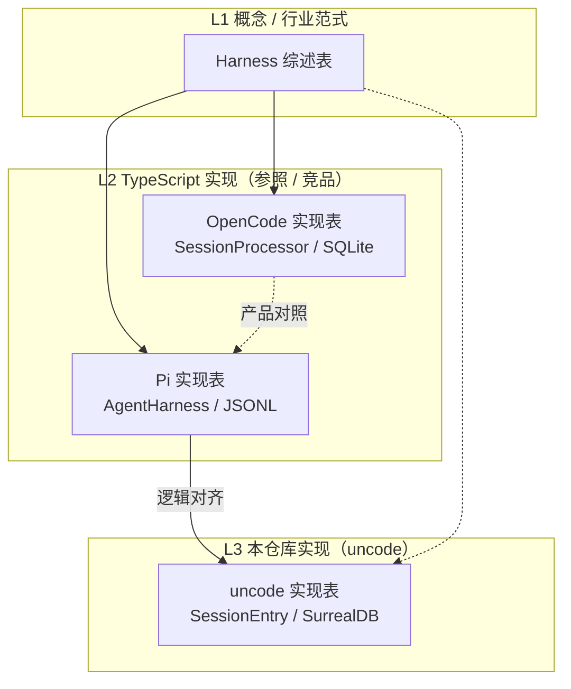

# 四份术语索引对照说明

> 对比本仓库内四份中英术语表的范围、抽象层次、分类结构与重叠关系，便于选型阅读与后续维护。  
> 被对照文档：
>
> - [`HARNESS_ENGINEERING_GLOSSARY.md`](HARNESS_ENGINEERING_GLOSSARY.md)（下称 **Harness 综述表**）
> - [`../pi-technologies/PI_TECHNOLOGIES_GLOSSARY.md`](../pi-technologies/PI_TECHNOLOGIES_GLOSSARY.md)（下称 **Pi 实现表**）
> - [`../opencode-technologies/OPENCODE_TECHNOLOGIES_GLOSSARY.md`](../opencode-technologies/OPENCODE_TECHNOLOGIES_GLOSSARY.md)（下称 **OpenCode 实现表**）
> - [`../uncode-technologies/UNCODE_TECHNOLOGIES_GLOSSARY.md`](../uncode-technologies/UNCODE_TECHNOLOGIES_GLOSSARY.md)（下称 **uncode 实现表**）

| 项 | 说明 |
|----|------|
| **文档类型** | 术语索引对照 / Meta-glossary |
| **路径** | `docs/technologies/GLOSSARIES_COMPARISON.md` |
| **最后更新** | 2026-05 |

---

## 1. 一句话定位

| 术语表 | 回答的问题 | 不回答的问题 |
|--------|------------|--------------|
| **Harness 综述表** | 「Coding Agent 的 Harness 是什么、业界如何组织质量与多 Agent？」 | 某函数叫什么、具体 crate 如何分层 |
| **Pi 实现表** | 「Pi（`pi-agent-core` / `pi-ai`）里类型与 API 叫什么、做什么？」 | OpenCode 的 SQLite Part 模型、uncode 的 SurrealDB |
| **OpenCode 实现表** | 「OpenCode（`packages/opencode`）里 SessionProcessor、session.next.* 等叫什么？」 | Pi 的 `convertToLlm`、uncode 的 `#[tool]` |
| **uncode 实现表** | 「uncode 源码与实现文档里 crate/API/事件叫什么？」 | Pi/OpenCode 的 TypeScript 专有机制 |

四者关系可概括为：**综述表定义概念与工程范式 → Pi / OpenCode 实现表描述两种 TypeScript 参照运行时 → uncode 实现表描述本仓库 Rust 运行时（逻辑对齐 Pi、物理自有取舍）**。

---

## 2. 元信息对照

| 维度 | Harness 综述表 | Pi 实现表 | OpenCode 实现表 | uncode 实现表 |
|------|----------------|-----------|-----------------|---------------|
| **主文档** | [`HARNESS_ENGINEERING.md`](HARNESS_ENGINEERING.md) | `docs/pi-technologies/PI_*.md` | `docs/opencode-technologies/OPENCODE_*.md` | `docs/uncode-technologies/UNCODE_*.md` |
| **分析对象** | 行业 Harness 实践 | `pi-agent-core`、`pi-ai` | `~/EA/opencode`（anomalyco/opencode） | uncode Rust workspace |
| **语言/栈** | 与实现无关 | TypeScript / Node | TypeScript / Bun + Effect | Rust（tokio、ratatui、SurrealDB） |
| **主题章节数** | 11 章 + 缩写专名 | 12 章 | 8 章 | 11 章 |
| **正文词条量级** | 约 90+ 条 | 约 120+ 条 | 约 70+ 条 | 约 115+ 条 |
| **附录** | 附录 A 英文 + **附录 B 拼音** | 英文 A–Z 精选 | 英文 A–Z 精选 | 英文 A–Z 全表（~140+） |
| **参见列** | 主文档 § | 本目录链接 | 本目录链接 | 本目录链接 |
| **跨表互链** | 无 | uncode、对齐文档 | Pi、Harness、对照本文 | Pi、OpenCode、对齐文档 |

---

## 3. 抽象层次

- **L1**：Compaction、P+G+E、治理闭环等，不绑定具体类名。  
- **L2（Pi）**：`convertToLlm`、`AgentHarness`、JSONL 会话树。  
- **L2（OpenCode）**：`SessionPrompt` / `SessionProcessor`、`session.next.*`、SQLite message/part、MCP 一等公民。  
- **L3（uncode）**：`SessionStore`、`AgentEvent`、`uncode-*` crate；与 Pi 差异见 [`UNCODE_PI_ALIGNMENT_AND_EVALUATION.md`](UNCODE_PI_ALIGNMENT_AND_EVALUATION.md)；与 OpenCode 见 [`OPENCODE_VS_PI.md`](OPENCODE_VS_PI.md)。

---

## 4. 章节结构对照

✓ = 独立小节，△ = 散落他处，— = 基本不涉及。

| 主题域 | Harness | Pi | OpenCode | uncode |
|--------|:-------:|:--:|:--------:|:------:|
| 范式 / Agent 公式 | ✓ 一 | △ 二 | △ 一 | △ 一、二 |
| 架构分层 | △ 二 | ✓ 二 | ✓ 二（Effect Service） | ✓ 二、三 |
| Turn / 双层循环 | △ | ✓ 三 | △（SessionProcessor） | ✓ 三、四 |
| Steering / Follow-up / NextTurn | — | ✓ 四 | △（无三队列专名） | ✓ 四 |
| 消息模型 | — | ✓ 四 AgentMessage | ✓ 三 MessageV2/Part | △ 五、七 |
| 会话树 | △ | ✓ 五 | △ parent_id | ✓ 五 SessionEntry |
| 会话物理存储 | — | ✓ JSONL | ✓ SQLite | ✓ SurrealDB + JSONL |
| Compaction | ✓ 三 | ✓ 六 | △ 五 compaction.* | ✓ 六 |
| 工具 / 沙箱 | ✓ 二 | ✓ 七 | ✓ 六 | ✓ 八 |
| 事件 / Hook | △ | ✓ 八 | ✓ 五 session.next.* | ✓ 九 |
| LLM Provider | — | ✓ 九 | ✓ 四 | ✓ 七 |
| Skills / Template | ✓ 二、七 | ✓ 十 | △ | △ 十一 |
| Server / Client | — | — | ✓ 七 | △ Platform |
| MCP / Plugin | △ MCP | —（非主路径） | ✓ 六 | — |
| 多 Agent P+G+E | ✓ 六 | — | △ build/plan/task | — |
| Fowler / 质量门禁 | ✓ 四、五 | — | — | — |
| TUI 专章 | — | — | △ | ✓ 十 |
| Crate / 运行模式 | — | — | △ 一 | ✓ 二、十一 |
| 逻辑 vs 物理会话 | — | — | — | ✓ 一、五 |

---

## 5. 高重叠概念（跨实现表）

读 **Pi / OpenCode / uncode** 实现文档时查对应列；读方案与培训时以 **Harness 综述表** 为准。

| 概念（中文） | Harness | Pi | OpenCode | uncode（L1 冻结） | 备注 |
|--------------|---------|-----|----------|-------------------|------|
| Agent（广义） | Agent | Agent / AgentHarness | Agent 角色配置 | uncode-agent / `AgentLoop` | |
| Harness | Harness | AgentHarness | Agent 运行时包 | `AgentHarness` | |
| 上下文压缩 | Compaction | Compaction | compaction.* 事件 | `Compaction` / `CompactionComplete` | |
| 编排循环 | ReAct / 编排循环 | 双层 while / `agentLoop` | SessionProcessor 多轮 | Dual-loop / `AgentLoop::run_inner` | |
| Turn | — | Turn | △ step.* | Turn / `TurnStart`·`TurnEnd` | |
| Steering | **人改 Harness** | Steering queue | △ 重入 prompt | Steering channel | **同名异义** |
| Follow-up | — | followUp queue | — | follow_up channel | L1 与 Pi 对齐 |
| 工具 | Tools | AgentTool | ToolRegistry | `ToolExecutor` | |
| 沙箱 | Sandbox | ExecutionEnv | Permission + 目录 | `resolve_path` | |
| 技能 | Skills | Skills | SkillTool | `SkillRegistry` | |
| 钩子 | Hooks | Harness Hook 20+ | Plugin / Bus | `EventRouter` / `ToolHooks` | |
| 模型 | Model | Model | Provider + Model | `Model` | |
| 会话树 | — | SessionTreeEntry | MessageV2 | `SessionEntry` | 逻辑同构；uncode 主存 SurrealDB |
| 子 Agent | P+G+E 角色 | —（哲学回避） | TaskTool 子 session | — | OpenCode 产品内建 |

> uncode L1 机制对照矩阵见 [`UNCODE_PI_MECHANISM_MAP.md`](../uncode-technologies/UNCODE_PI_MECHANISM_MAP.md)（#261）；词条级映射见 [`UNCODE_TECHNOLOGIES_GLOSSARY.md`](../uncode-technologies/UNCODE_TECHNOLOGIES_GLOSSARY.md) Pi/OpenCode 列。

---

## 6. 仅出现在单表的典型词条

### 6.1 仅 Harness 综述表

| 中文 | English | 为何不在三份实现表 |
|------|---------|-------------------|
| 上下文工程 | Context Engineering | 综述层，非 API |
| 狭义 Harness Engineering | Harness Engineering (narrow) | 方法论 |
| RAG | RAG | 非三实现核心路径 |
| Planner / Generator / Evaluator | P+G+E | 三实现多为单 Agent 主循环 |
| Rubric / Harnessability | Rubric / Harnessability | 评测 / Fowler |

（MCP 在 Harness 与 **OpenCode 实现表** 均有；uncode/Pi 表强调非主路径。）

### 6.2 仅 Pi 实现表

| 中文 | English | OpenCode / uncode 大致对应 |
|------|---------|---------------------------|
| convertToLlm | convertToLlm | AI SDK ModelMessage / build_context |
| AgentMessage | AgentMessage | MessageV2 / SessionEntry::Message |
| JsonlSessionStorage | JsonlSessionStorage | SQLite / SurrealDB |
| Pending Session Write | Pending Session Write | turn 边界 flush |
| QueueMode | QueueMode | TUI 队列策略 |
| Declaration merging | Declaration merging | Rust 无 |

### 6.3 仅 OpenCode 实现表

| 中文 | English | 说明 |
|------|---------|------|
| SessionPrompt | SessionPrompt | 编排层入口 |
| SessionProcessor | SessionProcessor | LLM 流 + 工具执行 |
| session.next.* | session.next.* | v2 细粒度 UI 事件 |
| MessageV2 / Part | MessageV2 / Part | 消息与流式片段分表 |
| SQLite 会话库 | SQLite session DB | 主持久化 |
| Drizzle ORM | Drizzle ORM | 表定义 |
| Doom loop | Doom loop | 工具重复检测 |
| Effect Service | Effect Service | Layer / Context.Service |
| opencode serve | opencode serve | HTTP server |
| @opencode-ai/llm | @opencode-ai/llm | 协议库（与运行时双轨） |
| build / plan Agent | build / plan agents | 产品多角色 |
| Client/Server 架构 | Client/Server | 长驻 server + attach |

### 6.4 仅 uncode 实现表

| 中文 | English | 说明 |
|------|---------|------|
| 逻辑 vs 物理（会话） | Logical vs physical session | SurrealDB vs JSONL |
| uncode-* crate | uncode-cli / uncode-ai … | 仓库专名 |
| #[tool] 宏 | #[tool] macro | 编译期 Schema |
| SurrealSessionStore | SurrealSessionStore | 主存 |
| AgentEvent（18） | AgentEvent | broadcast |
| TuiEngine | TuiEngine | ratatui |
| terminate AND | terminate AND semantics | 工具批次终止 |
| MSRV 1.85 | MSRV 1.85 | Rust 工具链 |

---

## 7. 三份实现表差异速查

### 7.1 Pi vs uncode（本仓库对齐轴）

| 维度 | Pi | uncode |
|------|-----|--------|
| 会话主存 | JSONL | SurrealDB + JSONL 互操作 |
| 摘要形态 | CompactionSummary **Message** | `SessionEntry::Compaction` |
| 事件 | 10 AgentEvent + 20+ Hook | 18 AgentEvent + EventRouter |
| 工具 | AgentTool + TypeBox | ToolExecutor + `#[tool]` |
| LLM 协议 | 9 内置 API | 4 协议 API-first |
| MCP | 非主路径 | 非主路径 |

详见 [`UNCODE_PI_ALIGNMENT_AND_EVALUATION.md`](UNCODE_PI_ALIGNMENT_AND_EVALUATION.md)。

### 7.2 Pi vs OpenCode（TypeScript 竞品轴）

| 维度 | Pi | OpenCode |
|------|-----|----------|
| 组织 | 可嵌入库分层 | 产品 monorepo + server |
| 循环 API | agentLoop / AgentHarness | SessionPrompt / SessionProcessor |
| 会话 | JSONL 树 | SQLite message/part |
| 事件 | AgentEvent + Hook 返回值 | session.next.* + Bus |
| 子 Agent | 哲学上外置 | TaskTool + build/plan |
| MCP | 非主路径 | 一等公民 |
| LLM | pi-ai 一体 | AI SDK 运行时 + `@opencode-ai/llm` |

详见 [`OPENCODE_VS_PI.md`](OPENCODE_VS_PI.md)、[`OPENCODE_OVERVIEW.md`](../opencode-technologies/OPENCODE_OVERVIEW.md)。

### 7.3 OpenCode vs uncode（跨语言对照）

| 维度 | OpenCode | uncode |
|------|----------|--------|
| 运行时 | Bun / Effect | Rust / tokio |
| 交付 | Server + Web/Desktop | TUI + Platform（规划） |
| 会话 | SQLite | SurrealDB |
| 流式 UI 协议 | session.next.* | AgentEvent |
| 工具面 | 宽（MCP、LSP、task…） | 精简 7+2，沙箱 CWD |

---

## 8. 附录与检索方式

| 能力 | Harness 综述表 | Pi / OpenCode / uncode 实现表 |
|------|----------------|------------------------------|
| 英文 A–Z | 附录 A（最全） | Pi/OpenCode：文末精选；uncode：全表 + 章节参见 |
| 中文拼音 | **附录 B（独有）** | 无；靠主题章节 |
| 缩写专章 | 第十一章 | 无 |
| API 跳转 | § 号 | Markdown 链接 |

**建议**：英文专名 → 四表附录；中文俗语 → Harness 附录 B；uncode 开发 → uncode 表；读 OpenCode 源码 → **OpenCode 实现表**；Pi 对齐 → Pi 表 + §7.1。

---

## 9. 推荐阅读顺序

| 读者目标 | 建议顺序 |
|----------|----------|
| 理解 Harness 概念 | Harness 综述表 → `HARNESS_ENGINEERING.md` |
| 读 uncode 设计 | Pi 表 → 对齐文档 → uncode 表 |
| 读 OpenCode 源码 | **OpenCode 实现表** → `OPENCODE_OVERVIEW` → `OPENCODE_VS_PI` |
| Pi ↔ OpenCode 对比 | Pi 表 + **OpenCode 表** + `OPENCODE_VS_PI` + 本文 §7.2 |
| Pi ↔ uncode diff | Pi 表 + uncode 表 + §7.1 + `SESSION_LAYER_COMPARISON_PI` |
| 四表名词歧义 | 本文 §5（Steering 等）→ 对应实现表 |
| 是否应与 Pi/OpenCode 趋同命名 | [`TERMINOLOGY_ALIGNMENT_STRATEGY.md`](TERMINOLOGY_ALIGNMENT_STRATEGY.md) |

---

## 10. 维护约定

1. **不合并为单表**：四层抽象混排不利于检索。  
2. **概念改名**：行业词改 Harness；Pi/OpenCode/uncode 各改对应实现表。  
3. **新增专名**：实现细节只进对应实现表；行业通用名再补 Harness。  
4. **Steering 等易混词**：改表时同步检查 §5。  
5. **结构性改版**：任一张术语表增删章节时，同步更新本文 §4、§6、§7。  
6. **OpenCode 实现表**：与 `docs/opencode-technologies/` 系列同步；上游 `~/EA/opencode` 大版本变更时复核 §7.2。

---

## 相关文档

| 文档 | 说明 |
|------|------|
| [HARNESS_ENGINEERING_GLOSSARY.md](HARNESS_ENGINEERING_GLOSSARY.md) | Harness 综述术语表 |
| [PI_TECHNOLOGIES_GLOSSARY.md](../pi-technologies/PI_TECHNOLOGIES_GLOSSARY.md) | Pi 术语表 |
| [OPENCODE_TECHNOLOGIES_GLOSSARY.md](../opencode-technologies/OPENCODE_TECHNOLOGIES_GLOSSARY.md) | **OpenCode 术语表** |
| [UNCODE_TECHNOLOGIES_GLOSSARY.md](../uncode-technologies/UNCODE_TECHNOLOGIES_GLOSSARY.md) | uncode 术语表 |
| [OPENCODE_OVERVIEW.md](../opencode-technologies/OPENCODE_OVERVIEW.md) | OpenCode 系列索引 |
| [OPENCODE_VS_PI.md](OPENCODE_VS_PI.md) | OpenCode 与 Pi 对比 |
| [UNCODE_PI_ALIGNMENT_AND_EVALUATION.md](UNCODE_PI_ALIGNMENT_AND_EVALUATION.md) | uncode 与 Pi 对齐 |
| [PI_OVERVIEW.md](../pi-technologies/PI_OVERVIEW.md) | Pi 系列索引 |
| [UNCODE_OVERVIEW.md](../uncode-technologies/UNCODE_OVERVIEW.md) | uncode 系列索引 |
| [TERMINOLOGY_ALIGNMENT_STRATEGY.md](TERMINOLOGY_ALIGNMENT_STRATEGY.md) | uncode 术语趋同 vs 引用策略 |

---

*本文档描述四份术语表之间的关系，不替代任一表内的词条定义。*
