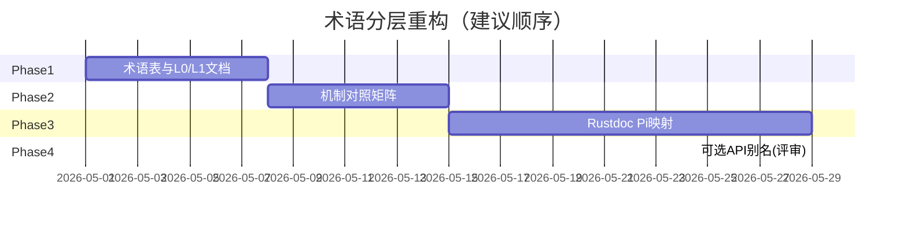

# uncode 术语分层重构方案（策略 C）

> 在已采纳 [`TERMINOLOGY_ALIGNMENT_STRATEGY.md`](TERMINOLOGY_ALIGNMENT_STRATEGY.md) **策略 C：分层混合** 的前提下，将 L0–L3 抽象层落实为**可执行、可验收、可分阶段**的重构计划。  
> **本方案以文档与可发现性为主**；**不包含**大规模 Rust 公开 API 改名（除非单独立项且版本化）。

| 项 | 说明 |
|----|------|
| **文档类型** | 重构方案 / Refactor plan |
| **路径** | `docs/technologies/TERMINOLOGY_LAYERED_REFACTOR_PLAN.md` |
| **策略依据** | TERMINOLOGY_ALIGNMENT_STRATEGY §3.3、§5 |
| **最后更新** | 2026-05 |
| **建议 Issue** | 创建如 `refactor/N-terminology-layered-alignment` 跟踪各 Phase |

---

## 1. 已采纳的分层模型（冻结）

```
L0 行业概念（Harness、Agent、Tool、Compaction、Sandbox）
    → 与 Pi/OpenCode 共用英文概念词；中文与 HARNESS 综述表对齐

L1 机制概念（Turn、Steering、Follow-up、Session 树、AgentHarness）
    → 与 Pi 对齐命名与语义；文档写「同 Pi 的 X」

L2 实现 API（Rust 类型、函数、crate）
    → uncode 自有 idiomatic 命名；术语表 + rustdoc 注明 Pi/OpenCode 映射

L3 产品交付（TUI、Platform、存储路径、配置）
    → 自有；OpenCode 仅作 UX/能力 benchmark
```

**冻结原则**：

| 层级 | 允许的重构 | 禁止的重构 |
|------|------------|------------|
| L0 | 统一中文/英文概念词、链到 Harness 表 | 把 uncode 专有实现名改成行业未定义新词 |
| L1 | 文档章节标题、叙事、机制对照表 | 无 Pi 等价语义时硬套 Pi 专名 |
| L2 | `///` 映射、术语表列、模块级 README | 仅为「像 Pi」而 `pub fn convert_to_llm` 等破坏性改名 |
| L3 | 自有产品名与路径；benchmark 脚注 | 复制 `opencode.json` 键名、SQLite 路径等 |

---

## 2. 现状评估（基线）

基于当前仓库（2026-05），各层**已对齐**与**待补齐**如下。

### 2.1 L0 — 行业概念

| 状态 | 项 |
|------|-----|
| ✅ 已有 | [`HARNESS_ENGINEERING_GLOSSARY.md`](HARNESS_ENGINEERING_GLOSSARY.md)、[`GLOSSARIES_COMPARISON.md`](GLOSSARIES_COMPARISON.md) |
| ⚠️ 待补齐 | `docs/uncode-technologies/*` 首章未统一指向 Harness 表；对外 README 未固定「Agent = Model + Harness」一句 |
| ⚠️ 待补齐 | 培训/贡献者材料中 **Steering** 与 Harness「治理闭环」混用风险未在 uncode 系列文内反复强调 |

### 2.2 L1 — 机制概念（Pi 主轴）

| 状态 | uncode 实现 / 文档 | Pi 对应 |
|------|-------------------|---------|
| ✅ | `AgentHarness`、`LoopEngine` 双环 | `AgentHarness`、`agentLoop` |
| ✅ | `MessageQueue`：steering / follow_up / next_turn | 三队列模型 |
| ✅ | `SessionEntry` 树、Compaction、BranchSummary | Session 树、压缩、分支摘要 |
| ✅ | `ToolResult::terminate` AND 语义 | 整批 terminate |
| ✅ | [`UNCODE_PI_ALIGNMENT_AND_EVALUATION.md`](UNCODE_PI_ALIGNMENT_AND_EVALUATION.md) | — |
| ⚠️ | 部分 `UNCODE_*.md` 未在每篇文首写「机制对齐 Pi」 | 应在 OVERVIEW 链出即可 |
| ⚠️ | `AgentEvent` 与 Pi 10 种 + Harness Hook **无对照矩阵** | 见 Phase 2 |

### 2.3 L2 — 实现 API

| 状态 | uncode | Pi 映射（文档应写明） |
|------|--------|---------------------|
| ✅ 自有合理 | `build_context` | `convertToLlm` 管线中的一环 |
| ✅ 自有合理 | `transform_context` | `transformContext` |
| ✅ 自有合理 | `SessionStore` / `SurrealSessionStore` | `JsonlSessionStorage`（物理不同） |
| ✅ 自有合理 | `AgentEvent`（18 variants） | `AgentEvent`（10）+ Harness hooks |
| ⚠️ | 公开类型 `///` 文档多数无 `Pi:` 行 | Phase 3 |
| ⚠️ | [`UNCODE_TECHNOLOGIES_GLOSSARY`](../uncode-technologies/UNCODE_TECHNOLOGIES_GLOSSARY.md) 无 **Pi 对应 / OpenCode 对应** 列 | Phase 1 |

### 2.4 L3 — 产品交付

| 状态 | 项 |
|------|-----|
| ✅ | `~/.uncode/config.toml`、SurrealDB、`uncode-tui` 自有 |
| ✅ | OVERVIEW 已写「对标 OpenCode scrollback」类 benchmark |
| ⚠️ | Platform HTTP 事件命名未与 `session.next.*` 对照（若未来对齐，单独立项） |
| ❌ 不在范围 | 引入 OpenCode 式 build/plan、MCP 主路径（除非新 ADR + Issue） |

---

## 3. 重构目标与非目标

### 3.1 目标

1. **读者路径清晰**：从行业词（L0）→ Pi 机制（L1）→ uncode API（L2）→ 产品（L3），每层有固定文档入口。  
2. **对照可维护**：`UNCODE_TECHNOLOGIES_GLOSSARY` 成为 L2 权威映射表；Pi/OpenCode 表保持只读参照。  
3. **贡献者可执行**：PR 检查项可引用本文 Phase 清单，减少口头「和 Pi 一样」。  
4. **零行为回归**：本方案 Phase 1–3 **不改变运行时语义**；Phase 4 仅限可选、需评审的 API 别名。

### 3.2 非目标

- 全仓库将符号改为 Pi 英文名。  
- 将事件模型改为 OpenCode `session.next.*` 字符串协议。  
- 替换 SurrealDB 为 JSONL/SQLite 以「像 Pi/OpenCode」。  
- 在未写 ADR 的情况下更改 MCP / 子 Agent / plan mode 产品立场。

---

## 4. 分阶段实施计划



### Phase 1 — 术语表与 L0/L1 文档（优先级 P0）

**工作量**：小 | **风险**：无代码 | **建议先行**

| 任务 ID | 层级 | 交付物 | 验收标准 |
|---------|------|--------|----------|
| P1-1 | L0 | 在 [`UNCODE_OVERVIEW.md`](../uncode-technologies/UNCODE_OVERVIEW.md) 增加 **「术语分层」** 小节（链本文 + 策略文） | 新贡献者 5 分钟内能找到 L0–L3 定义 |
| P1-2 | L0 | [`UNCODE_TECHNOLOGIES_GLOSSARY`](../uncode-technologies/UNCODE_TECHNOLOGIES_GLOSSARY.md) 表头增加列：**Pi 对应**、**OpenCode 对应**（可空） | L1 机制词 100% 有 Pi 列；OpenCode 列覆盖有对照的项 |
| P1-3 | L1 | 新建 [`UNCODE_PI_MECHANISM_MAP.md`](../uncode-technologies/UNCODE_PI_MECHANISM_MAP.md)（机制对照一页纸） | 覆盖：双环、Turn、三队列、Session 树、Compaction、terminate、事件阶段 |
| P1-4 | L0 | [`README.md`](../../README.md) / [`AGENTS.md`](../../AGENTS.md) 各增加 1 段：对外先用 Harness 语言，实现逻辑对齐 Pi | 与策略 C 表述一致 |
| P1-5 | L0 | 在 [`UNCODE_LOOP_ENGINE`](../uncode-technologies/UNCODE_LOOP_ENGINE.md)、[`UNCODE_SESSION_MODEL`](../uncode-technologies/UNCODE_SESSION_MODEL.md) 文首加 **L1 对齐声明**（1–2 句 + 链 Pi 文档） | 不改正文结构也可 |

**P1-2 列填写规则**：

| 列 | 填写内容示例 |
|----|--------------|
| Pi 对应 | `convertToLlm`（概念）；无则 `—` |
| OpenCode 对应 | `SessionProcessor`（仅对照）；无则 `—` |

---

### Phase 2 — L1 机制对照矩阵（优先级 P0）

**工作量**：中 | **风险**：无代码

| 任务 ID | 交付物 | 说明 |
|---------|--------|------|
| P2-1 | **事件对照表**（写入 `UNCODE_PI_MECHANISM_MAP.md` 或 `UNCODE_EVENT_SYSTEM.md` 附录） | 行：Pi AgentEvent + 关键 Harness hook；列：uncode `AgentEvent`；标注 1:1 / 1:N / 无 |
| P2-2 | **会话条目对照表** | Pi SessionEntry 类型 ↔ `SessionEntry` 枚举变体 |
| P2-3 | **循环阶段对照表** | Pi `prompt()` 事件序列 ↔ uncode `run_inner` 步骤（可引用 REQUEST_LIFECYCLE） |
| P2-4 | 更新 [`GLOSSARIES_COMPARISON.md`](GLOSSARIES_COMPARISON.md) §5 | 补充 uncode 列中已冻结的 L1 用词 |

**事件对照表（已实施）**：见 [`UNCODE_PI_MECHANISM_MAP.md`](../uncode-technologies/UNCODE_PI_MECHANISM_MAP.md) §5.1–5.3；[`UNCODE_EVENT_SYSTEM.md`](../uncode-technologies/UNCODE_EVENT_SYSTEM.md) 文首已链入。

> 权威源码：`uncode-core/src/event.rs`；Pi 参照 [`PI_EVENT_SYSTEM.md`](../pi-technologies/PI_EVENT_SYSTEM.md)。

---

### Phase 3 — L2 Rustdoc 与模块映射（优先级 P1）

**工作量**：中–大 | **风险**：低（仅文档注释）

| 任务 ID | 范围 | 规则 |
|---------|------|------|
| P3-1 | `uncode-core` 公开项 | 每个 `pub` type/trait/fn 增加 `///` 块：首行 uncode 语义；次行 `/// **Pi:** …`（可选 `/// **OpenCode:** …`） |
| P3-2 | `uncode-agent` | 优先：`AgentHarness`、`LoopEngine`、`context_builder::build_context`、`MessageQueue`、`SessionStore` trait |
| P3-3 | `uncode-ai` | `Api`、`StreamEvent`、`Model` — 链到 `LLM_DRIVER_DESIGN` + Pi `pi-ai` |
| P3-4 | 模块级 | `uncode-agent/src/lib.rs`、`loop_engine.rs` 顶部 `//!` 写 L1 对齐摘要 |

**Rustdoc 模板（复制到贡献指南）**：

```rust
/// 从会话存储构建发往 LLM 的消息列表与有效模型配置。
///
/// **Pi:** 对应 `transformContext` 之后、`convertToLlm` 之前的上下文组装。
/// **OpenCode:** 无直接同名 API；对照 `SessionPrompt` 编排 + `MessageV2` 持久化。
pub async fn build_context(...) -> ...
```

**验收**：`cargo doc --no-deps` 生成页中，上述符号可见 Pi 行；不要求每个私有函数都写。

---

### Phase 4 — 可选 API 别名（优先级 P2，默认不做）

仅当 **降低 Pi 迁移者成本** 且有版本计划时考虑：

| 候选 | 方案 | 风险 |
|------|------|------|
| `convert_to_llm` 作为 `build_context` 的 `#[deprecated]` 别名 | 增加 API 面 | 误导（二者非完全等价） |
| `type AgentLoop = LoopEngine` | 类型别名 | 低，可接受 |

**门禁**：须单独 Issue + CHANGELOG + 至少维护一个发行版的 deprecated 周期；**本重构方案默认不启动 Phase 4**。

---

## 5. 按 Crate 的任务清单（L2 重点）

| Crate | Phase 1 文档 | Phase 2 矩阵 | Phase 3 rustdoc |
|-------|:------------:|:------------:|:---------------:|
| `uncode-shared` | 配置/错误中文描述 | — | 低优先级（backlog） |
| `uncode-macros` | Glossary §八 | — | 可选（backlog） |
| `uncode-ai` | Glossary §七 | — | ✅ `Api` / `StreamEvent` / `Model` / `ModelRegistry` |
| `uncode-core` | Glossary §一–六、九 | ✅ 机制图 §4–5 | ✅ 核心 `pub` 类型 |
| `uncode-agent` | LOOP/SESSION 文首 | ✅ 机制图 §2–3、§6 | ✅ Harness / Loop / 队列 / Store / compaction |
| `uncode-tui` | Glossary §十 | — | 低（backlog） |
| `uncode-platform` | — | — | 低（待规划） |
| `uncode-cli` | README 术语段 | — | 低 |
| `uncode-extensions` | Glossary §九 Hook | — | 可选（backlog） |

---

## 6. PR 与 Review 检查清单

合并涉及术语/文档的 PR 时，Reviewer 可勾选：

- [ ] 是否说明改动属于 **L0 / L1 / L2 / L3** 哪一层？
- [ ] L1 机制是否链到 Pi 文档或 `UNCODE_PI_MECHANISM_MAP`？
- [ ] 是否引入 OpenCode 专名却未标明「仅对照」？
- [ ] 是否修改公开 Rust 符号名？若是，是否有 Issue + 破坏性变更说明（默认应否）
- [ ] `UNCODE_TECHNOLOGIES_GLOSSARY` 是否同步（若新增用户可见概念词）
- [ ] 是否混淆 **Steering（运行时）** 与 **Steering（Harness 治理）**

---

## 7. 验收标准（整项重构完成）

| # | 标准 | 状态（PR [#263](https://github.com/FDE-GROUP/uncode/pull/263)） |
|---|------|------|
| A1 | `UNCODE_TECHNOLOGIES_GLOSSARY` 含 Pi/OpenCode 列，且 L1 机制节（§三–§六）Pi 列无空 | ✅ |
| A2 | 存在 `UNCODE_PI_MECHANISM_MAP.md`，含事件 + 会话 + 循环三张对照表 | ✅ §4–§6 |
| A3 | `uncode-agent` / `uncode-core` 核心公开 API 的 `cargo doc` 含 Pi 映射 | ✅ |
| A4 | `TERMINOLOGY_ALIGNMENT_STRATEGY`、本文、`GLOSSARIES_COMPARISON` 互链完整 | ✅ |
| A5 | **无**未文档化的公开 API 批量改名 | ✅ Phase 4 未启动 |
| A6 | CI 仍全绿（`fmt`、`clippy`、`test`） | ✅ [#263](https://github.com/FDE-GROUP/uncode/pull/263)、[#264](https://github.com/FDE-GROUP/uncode/pull/264) |

---

## 8. 风险与回滚

| 风险 | 缓解 |
|------|------|
| 对照表过时 | 表内注明「以 commit/文档日期为准」；Pi 升级时只更新映射表，不改 uncode API |
| 贡献者误以为 API 与 Pi 可互换 | 映射表加粗 **「概念对齐，非源码兼容」** |
| Phase 3 工作量膨胀 | 只覆盖 `pub` 且出现在 OVERVIEW 的符号；其余 backlog |
| 与 OpenCode 对照过载 | OpenCode 列只写「有产品差异时」条目，不追求全覆盖 |

回滚：Phase 1–3 均为文档/rustdoc，按 PR 回退即可；无数据迁移。

---

## 9. GitHub Issues（开发跟踪）

| Issue | 标题 | Phase |
|-------|------|-------|
| [#255](https://github.com/FDE-GROUP/uncode/issues/255) | **Epic** — 术语分层重构（策略 C） | 全案 |
| [#256](https://github.com/FDE-GROUP/uncode/issues/256) | UNCODE_OVERVIEW 术语分层小节 | P1-1 |
| [#257](https://github.com/FDE-GROUP/uncode/issues/257) | Glossary Pi/OpenCode 映射列 | P1-2 |
| [#258](https://github.com/FDE-GROUP/uncode/issues/258) | 新增 UNCODE_PI_MECHANISM_MAP | P1-3 |
| [#259](https://github.com/FDE-GROUP/uncode/issues/259) | README/AGENTS 术语策略摘要 | P1-4 |
| [#260](https://github.com/FDE-GROUP/uncode/issues/260) | LOOP/SESSION L1 对齐声明 | P1-5 |
| [#261](https://github.com/FDE-GROUP/uncode/issues/261) | 机制对照矩阵（事件/会话/循环） | P2-1~4 |
| [#262](https://github.com/FDE-GROUP/uncode/issues/262) | 核心 crate rustdoc Pi 映射 | P3-1~4 |

建议实施顺序：`#256` → `#257` → `#258` → `#260` → `#261` → `#259` → `#262`（见 Epic #255 描述）。

### 实施状态（2026-05）

**Epic [#255](https://github.com/FDE-GROUP/uncode/issues/255) 已关闭** — Phase 1–3 必做项全部落地；Phase 4 未启动。

| Phase | Issue | 状态 | 交付 |
|-------|-------|------|------|
| 1 | #256–#260 | ✅ 已完成 | [PR #263](https://github.com/FDE-GROUP/uncode/pull/263) |
| 1 | [#259](https://github.com/FDE-GROUP/uncode/issues/259) | ✅ 已完成 | [PR #264](https://github.com/FDE-GROUP/uncode/pull/264)（README + backlog rustdoc 起步） |
| 2 | #261 | ✅ 已完成 | `UNCODE_PI_MECHANISM_MAP` §5–§6；glossary §二、§七–§十一 |
| 3 | #262 | ✅ 已完成 | 核心 crate `/// **Pi:**`；见 `CONTRIBUTING.md` 约定 |
| 4 | — | ⏸ 默认不做 | 须单独 Issue |

**Backlog（可选，非 Epic 范围）**：跟踪 [Issue #265](https://github.com/FDE-GROUP/uncode/issues/265)。

| 项 | Crate | 说明 |
|----|-------|------|
| rustdoc Pi 映射 | `uncode-tui` | ✅ #266 批次 |
| rustdoc Pi 映射 | `uncode-extensions` | ✅ #266 批次 |
| rustdoc | `uncode-macros` | ✅ crate `//!` + `#[tool]` |
| glossary | 附录 A–Z | 不强制 Pi 列（仍可选） |
| 行为对齐（可选） | 测试 / 文档 | ✅ `validate_pi_turn_lifecycle_order` fixture；`UNCODE_SESSION_MODEL` JSONL↔Pi 表 |

---

## 10. 相关文档

| 文档 | 关系 |
|------|------|
| [TERMINOLOGY_ALIGNMENT_STRATEGY.md](TERMINOLOGY_ALIGNMENT_STRATEGY.md) | 策略依据（已采纳策略 C） |
| [GLOSSARIES_COMPARISON.md](GLOSSARIES_COMPARISON.md) | 四表术语对照 |
| [UNCODE_PI_ALIGNMENT_AND_EVALUATION.md](UNCODE_PI_ALIGNMENT_AND_EVALUATION.md) | Pi 机制对齐评价 |
| [UNCODE_TECHNOLOGIES_GLOSSARY.md](../uncode-technologies/UNCODE_TECHNOLOGIES_GLOSSARY.md) | Phase 1 主改对象 |
| [PI_TECHNOLOGIES_GLOSSARY.md](../pi-technologies/PI_TECHNOLOGIES_GLOSSARY.md) | L1 参照 |
| [OPENCODE_TECHNOLOGIES_GLOSSARY.md](../opencode-technologies/OPENCODE_TECHNOLOGIES_GLOSSARY.md) | L3 benchmark 参照 |

---

*路径：`docs/technologies/TERMINOLOGY_LAYERED_REFACTOR_PLAN.md` — 策略 C 的可执行重构方案，默认不改动公开 API 名称。*
