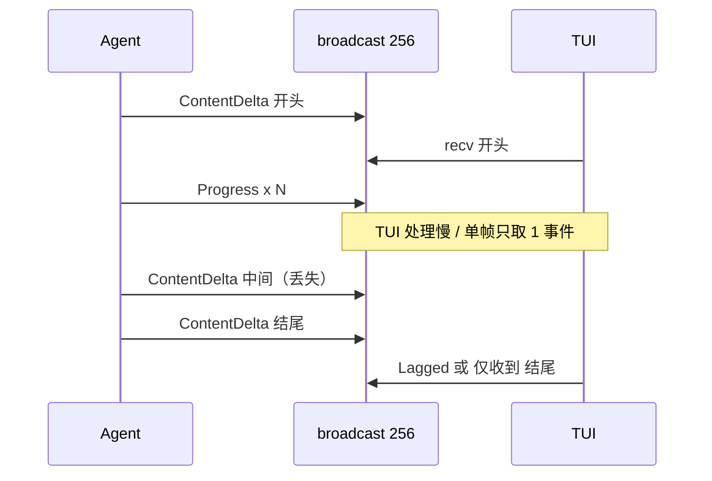

# uncode TUI 流式输出渲染问题与修复说明

> 文档版本：2026-05-27  
> 涉及模块：`uncode-tui`、`uncode-agent`（事件通道）  
> 相关对照：[`UNCODE_TUI_ALIGNMENT_IMPLEMENTATION_PLAN.md`](UNCODE_TUI_ALIGNMENT_IMPLEMENTATION_PLAN.md) §5.6、`UNCODE_OPENCODE_TUI_ALIGNMENT.md`

---

## 1. 问题现象

用户在 TUI 对话区观察 Assistant 流式输出时，曾出现以下一类或组合症状：

| 现象 | 用户描述 |
|:---|:---|
| **只见末尾** | 流式时始终像从最后几行开始显示，前面的内容看不到 |
| **黄色一闪** | 助手消息刚开始时，短暂出现黄色文字，随即消失 |
| **假停住** | 流式输出一小段后画面不再更新，过一段时间才恢复 |
| **首尾无中间** | 恢复后能看到开头和结尾，中间大段内容缺失 |

需区分两类根因：

- **视口裁剪**：内容已在内存中完整累积，但 `scroll_offset` / `render_viewport` 只画了其中一段。
- **数据丢失**：`ChatMessage::Assistant.text` 本身缺少中间的 `ContentDelta`，属于事件管道问题。

---

## 2. 架构与数据流

### 2.1 端到端路径


### 2.2 关键设计点

- **完整文本**保存在 `ChatMessage::Assistant { text, expanded }`，由多次 `ContentDelta` 追加。
- **可见内容**来自虚拟滚动：`line_counts` / `prefix_sum` 计总行数，`render_viewport` 只输出当前视口内的 `cached_lines` 切片。
- **自动跟随**由 `auto_scroll` + `scroll_offset` 控制，默认在接近底部时钉住全局末尾。

相关源码：

| 职责 | 文件 | 符号 |
|:---|:---|:---|
| 事件追加 | `crates/uncode-tui/src/chat.rs` | `append_assistant_text` |
| 行数缓存与渲染 | `crates/uncode-tui/src/chat.rs` | `ensure_line_counts`、`render_viewport` |
| 滚动与视口 | `crates/uncode-tui/src/lib.rs` | `render_chat` |
| 事件发送 | `crates/uncode-agent/src/loop_engine.rs` | `emit`、`broadcast::channel` |
| 主循环 | `crates/uncode-tui/src/lib.rs` | `TuiEngine::run` |

---

## 3. 根因分析

### 3.1 视口钉在底部 + `raw_skip`（只见末尾）

`render_chat` 在 `auto_scroll` 时将：

```text
scroll_offset = total_lines - visible_height
```

`render_viewport` 对第一条可见消息做行内跳过：

```text
raw_skip = scroll_offset - prefix_sum[first]
显示 cached_lines[raw_skip ..]
```

当单条 Assistant 消息高度超过一屏时，视口只包含该消息的**尾部行**。前面的 token 已在 `cached_lines` 中，但未进入当前帧的 `Paragraph`。

**结论**：不是「没渲染」，是「没画进视口」。

---

### 3.2 黄色一闪（开头曾出现）

默认主题中 Markdown **标题** 使用黄色（`theme.markdown.heading`）。

流式开头常为 `## …` / `# …`，故第一帧在视口内时会看到黄色标题行。随后 `scroll_offset` 下移或 `raw_skip` 增大，该行滚出可见区域，用户感觉「闪一下就被挡住」。

---

### 3.3 重复的 `auto_scroll` 赋值（修复尝试被覆盖）

曾增加「长 Assistant 滚到 `msg_start`」逻辑，但其后仍有一段无条件的：

```rust
self.chat.scroll_offset = total_lines.saturating_sub(visible_height);
```

第二段每帧覆盖第一段，导致「滚到消息顶」的策略从未生效。该重复块已删除。

---

### 3.4 视口钉在 `msg_start`（假停住 + 首尾无中间）

另一版修复在 `agent_busy` 时将 `scroll_offset = msg_start`（本条 Assistant 顶部）。

| 阶段 | 行为 |
|:---|:---|
| 流式进行中 | 视口冻结在开头几行，新 token 在屏幕**下方**增长，用户以为「停住不渲染」 |
| `agent_busy` 结束 | `scroll_offset` 回到全局底部，突然只看到**结尾** |
| 用户回看 | 开头仍在第一条 Assistant 顶部；若未手动滚动浏览，误以为「中间消失」 |

**结论**：中间内容多在缓存中，但流式期间从未进入视口；与真丢字不同，但主观体验类似「只有首尾」。

**最终滚动策略**（当前实现）：

```rust
scroll_offset = target.max(msg_start)
```

- `target`：跟随对话底部（含本条新 token）。
- `msg_start`：不滚到本条 Assistant **之前** 的旧历史之上。
- 需用 `trailing_assistant_start_line()`，因 `TodoList` 可能 push 在 Assistant **之后**，`messages.last()` 不是 Assistant。

---

### 3.5 `TodoList` 改变 `messages.last()`

`append_assistant_text` 在检测到 Markdown todo（`- [ ]`）时会 `upsert_todo_list`，在 Assistant **后面** 插入 `TodoList`：

```text
… → Assistant（流式）→ TodoList
```

若滚动逻辑仅用 `messages.last()` 判断 Assistant，会误判并退回「全局底部」策略。因此增加：

- `ChatState::trailing_assistant_index()`
- `ChatState::trailing_assistant_start_line()`

---

### 3.6 Assistant 禁用增量 Markdown 渲染

`ensure_line_counts` 中曾对最后一条消息做 `render_incremental`（保留旧行前缀、只拼尾部）。Markdown 重排时**前缀行号也会变化**，会导致缓存行与真实内容不一致。

当前对 `ChatMessage::Assistant` 显式跳过增量路径，每次 `invalidate` 后**整段重渲染**：

```rust
let is_assistant = matches!(self.messages[idx], ChatMessage::Assistant { .. });
let can_incremental = is_last && !is_assistant && ...
```

---

### 3.7 Broadcast 丢事件（中间文字真丢失）

Agent 通过 `tokio::sync::broadcast` 向 TUI 推送事件，原容量 **256**。

工具执行期间（尤其 `bash`）会高频发送 `ToolCallProgress`，与 `ContentDelta` 共用同一通道。TUI 主循环原先：

1. 每轮 `select!` 只处理 **一个** `recv()` 成功事件；
2. 使用 `Ok(event) = event_rx.recv()`，**不处理** `RecvError::Lagged`；
3. 当接收端落后时，中间若干 `ContentDelta` **永久丢失**。

表现：`Assistant.text` 只有最早与最晚收到的片段 → **有头有尾、无中间**；工具执行阶段也像「停住」（无 Text 事件）。



---

### 3.8 工具调用拆分两条 Assistant（结构性格局）

事件顺序常为：

```text
ContentDelta（Assistant #1 前文）
  → ToolCallStart（插入 ToolTurnGroup，last 不再是 Assistant）
  → 工具执行（无 ContentDelta）
  → ContentDelta（新建 Assistant #2，仅含工具后文）
```

`append_assistant_text` 仅在 `messages.last()` 为 `Assistant` 时追加，否则 `push_message` 新气泡。

因此「开头」在第一条 Assistant，「结尾」在第二条，**中间叙事可能在工具卡片**（bash stdout 等），而非 Assistant 文本。这与 broadcast 丢包是不同层问题；若需单一连续气泡，需另行做消息合并（当前未改）。

---

## 4. 修复方案汇总

| # | 问题 | 修复 | 位置 |
|:--|:---|:---|:---|
| 1 | 重复 `scroll_offset` 覆盖 | 删除第二段无条件跟底赋值 | `lib.rs` `render_chat` |
| 2 | 钉死 `msg_start` 导致假停住 | 改为 `target.max(msg_start)` | `lib.rs` `render_chat` |
| 3 | `TodoList` 后 `last()` 非 Assistant | `trailing_assistant_*` | `chat.rs` |
| 4 | Assistant 增量渲染风险 | `!is_assistant` 跳过 incremental | `chat.rs` `ensure_line_counts` |
| 5 | Broadcast 容量不足 | `256` → `4096` | `loop_engine.rs` |
| 6 | 单帧只处理一个事件 | `process_agent_event_batch` + `try_recv` 排空 | `lib.rs` |
| 7 | `Lagged` 未处理 | `on_agent_events_lagged` + 用户可见 Summary 警告 | `lib.rs` |

### 4.1 滚动（`render_chat`）

```rust
if self.agent_busy {
    if let Some(msg_start) = self.chat.trailing_assistant_start_line() {
        self.chat.scroll_offset = target.max(msg_start);
    } else {
        self.chat.scroll_offset = target;
    }
} else {
    self.chat.scroll_offset = target;
}
```

### 4.2 事件批处理与 Lagged（`TuiEngine::run`）

- `recv()` 改为 `match agent_result`，分支处理 `Ok` / `Lagged` / `Closed`。
- `process_agent_event_batch`：在首个事件后继续 `try_recv` 直到队列空，同帧内处理积压。
- `on_agent_events_lagged`：`invalidate_all` + 每会话一次 Summary 提示。

### 4.3 通道容量（`AgentLoop`）

```rust
let (event_tx, _) = broadcast::channel(4096);
```

---

## 5. 验证方法

### 5.1 视口与滚动

1. 启动 TUI，发起会产生长 Markdown 回复的任务。
2. 流式过程中应**持续向下更新**末尾内容，而非长时间冻在开头。
3. `PgUp` / 滚轮向上应能浏览已输出内容的更早行（证明缓存完整）。

### 5.2 事件丢失

1. 触发含 `bash` 等多行 `ToolCallProgress` 的任务。
2. 不应再出现「仅首尾、中间空白」且无解释的情况。
3. 若仍落后，应出现 **「⚠ 显示落后 N 个事件」** Summary（`lag_warning_shown` 每会话一次）。

### 5.3 回归测试

```bash
RUSTFLAGS="-D warnings" cargo test -p uncode-tui -- --test-threads=1
```

包含 `test_trailing_assistant_index_skips_todo_after`（Todo 在 Assistant 之后时仍能定位 trailing assistant）。

---

## 6. 调试备忘

| 症状 | 优先怀疑 |
|:---|:---|
| 能滚上去看到全文 | 视口 / `scroll_offset`，查 `render_chat`、`render_viewport` |
| 滚上去仍缺段 | `ContentDelta` 丢失，查 broadcast `Lagged` 日志、`Assistant.text` 长度 |
| 工具执行时画面不动 | 正常（无 Text 事件）；看工具卡片 Progress |
| 两段 Assistant 夹工具 | 消息结构拆分，非渲染 bug |

启用日志：

```bash
RUST_LOG=uncode_tui=debug,uncode_agent=debug cargo run -p uncode-cli
```

关注：`TUI lagged N agent events`。

---

## 7. 后续改进与 GitHub Issues

| Issue | 优先级 | 状态 | 说明 |
|:---|:---|:---|:---|
| [#591](https://github.com/FDE-GROUP/uncode/issues/591) | P0 | ✅ 已修复 | TodoList 后 `append_assistant_text` 误建新 Assistant |
| [#592](https://github.com/FDE-GROUP/uncode/issues/592) | P0 | ✅ 已修复 | 主循环阻塞 poll / 先 draw 后收事件 |
| [#593](https://github.com/FDE-GROUP/uncode/issues/593) | P1 | ✅ 已修复 | `prefix_sum` 分隔行与 `message_start_line` 对齐 |
| [#594](https://github.com/FDE-GROUP/uncode/issues/594) | P1 | ✅ 已修复 | Lagged / TurnEnd 后从 Session 同步 trailing Assistant |
| [#595](https://github.com/FDE-GROUP/uncode/issues/595) | P2 | ✅ 已修复 | 工具后新 Assistant 气泡；bash stdout tail 窗口 |

### 7.1 第二轮修复（#591 / #592 / #593）

**#591 — trailing assistant 一致性**

- `append_assistant_text` / todo 解析改用 `trailing_assistant_index()`，不再依赖 `messages.last()`。
- 流式光标对 **trailing** Assistant 生效（`TodoList` 在末尾时仍显示 `█`）。

**#592 — 主循环事件优先级**

- `agent_busy` 时每轮先 `try_recv` drain，再进入 `select!`。
- UI `poll` 在 busy 时为 `Duration::ZERO`（非阻塞）。
- **`terminal.draw` 移到 `select!` 之后**，先处理事件再渲染。

**#593 — prefix_sum**

- `prefix_sum[i]` 改为消息 `i` **正文起始**全局行号；分隔行位于 `start - 1`（`i > 0`）。

### 7.2 第三轮修复（#594 / #595）

**#594 — Lagged 后 Session 重同步**

- `last_assistant_text_from_entries()` 从持久化条目取最后一条 Assistant 文本。
- `ChatState::reconcile_trailing_assistant_text()`：当 Session 文本更长时覆盖 trailing Assistant。
- `TuiEngine::sync_trailing_assistant_from_session()` 在 `on_agent_events_lagged`、`TurnEnd`、`SessionEnd` 时调用。
- 说明：流式中途 Session 尚未落盘，重同步主要在 **TurnEnd 之后**生效。

**#595 — 工具后气泡与 bash tail**

- `append_target_assistant_index()`：`TodoList` 后仍追加到同一 Assistant；`ToolTurnGroup` 后创建/追加到**新** Assistant（正确叙事顺序）。
- `active_streaming_assistant_*` 用于流式光标与滚动锚点。
- `render_bash` 截断时显示 **stdout 尾部**（`skip(total - max_show)`），并提示省略的早期行数。

### 7.3 仍待实现

1. **Progress 节流**：降低 `ToolCallProgress` 发射频率或 TUI 侧合并 invalidate
2. **MessageEnd 快照**：在事件中携带完整 Assistant 文本，避免 TurnEnd 前无法重同步

---

## 8. 变更文件清单

| 文件 | 变更摘要 |
|:---|:---|
| `crates/uncode-tui/src/lib.rs` | `render_chat` 滚动；`process_agent_event_batch`；`on_agent_events_lagged` + Session 同步；主循环 drain + draw 顺序 |
| `crates/uncode-tui/src/chat.rs` | `trailing_assistant_*` / `active_streaming_assistant_*`；append/cursor；`prefix_sum`；Assistant 禁用 incremental；bash tail；`reconcile_trailing_assistant_text` |
| `crates/uncode-agent/src/loop_engine.rs` | `broadcast::channel(4096)` |

---

## 9. 术语对照

| 术语 | 含义 |
|:---|:---|
| `cached_lines` | 单条消息 Markdown 渲染后的 `Vec<Line>` 缓存 |
| `prefix_sum` | 全局行号前缀和，用于虚拟滚动定位 |
| `scroll_offset` | 视口顶部在全局行坐标中的偏移 |
| `raw_skip` | 视口首条消息内的行内跳过量 |
| `Lagged(n)` | broadcast 接收端落后，跳过 `n` 条未投递事件 |
